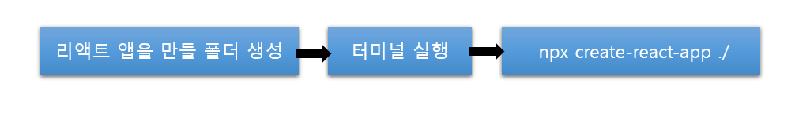

## Create React App으로 리액트 설치하기 

##### ◼ 리액트 앱 설치 방법 

```
npx create-react-app <폴더 이름>
```

> 현재 빠르게 리액트를 설치 할 수 있는 방법 


◼ react-disney-plus-app 폴더 생성 및 리액트 설치 

```
npx create-react-app ./
```



> create-react-app을 사용하여 리액트를 설치해준다. 
>
> 이렇게 하면 Babel이나 Webpack 설정이 이미 다 되어 있는 상태이기에, 많은 시간을 소요하지 않고 리액트 앱을 시작할 수 있다. 