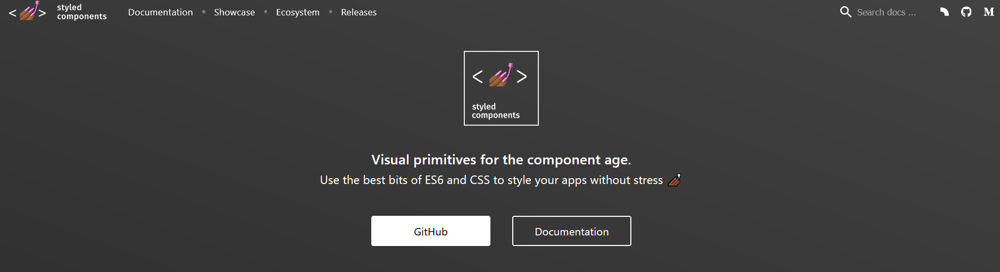

## Styled Component에 대해 알아보기 


```bash
# with npm 
npm install --save styled-components

# with yarn
yarn add styled-components
```


```bash
npm install styled-components --save
```


#### [Styled Component](https://styled-components.com/)



**styled-components is the result of wondering how we could enhance CSS for styling React component systems.** By focusing on a single use case we managed to optimize the experience for developers as well as the output for end users.


##### ◼ 가장 기초적인 스타일 컴포넌트 

> styled-components utilises tagged template literals to style your components.
>
> It removes the mapping between components and styles. This means that when you're defining your styles, you're actually creating a normal React  component, that has your styles attached to it.
>
> This example creates two simple components, a wrapper and a title, with some styles attached to it:


##### ◼ 장점 : Adapting based on props

> You can pass a function ("interpolations") to a styled component's template literal to adapt it based on its props.
>
> This button component has a primary state that changes its color. When setting the primary prop to true, we are swapping out its background and text color.


##### ◼ Extending Styles

> Quite frequently you might want to use a component, but change it  slightly for a single case. Now, you could pass in an interpolated  function and change them based on some props, but that's quite a lot of  effort for overriding the styles once.
>
> To easily make a new component that inherits the styling of another, just wrap it in the styled() constructor. Here we use the button from the last section and create a  special one, extending it with some color-related styling:


