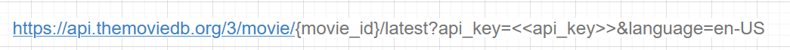

## The Movie DB API Key 생성하기 

#### 1. [THE MOVIE DB API KEY](https://www.themoviedb.org/) 로 이동하기 

#### 2. 가입 후 API_KEY 받기 

##### 프로필 사진 > 설정 > API 

##### ◼ 최근 영화를 넣고 싶다면? _ Get Movie BY Latest

##### ◼ 어떤 한 영화의 디테일한 정보를 가져오고 싶다면?_ Get Movie Detail

##### ◼ 영화의 리뷰를 가져오고 싶다면? _ Get Movie Reviews

##### ◼ 티랜드한 영화를 가져오고 싶다면?_Get_Trending

