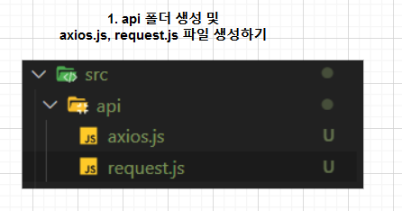
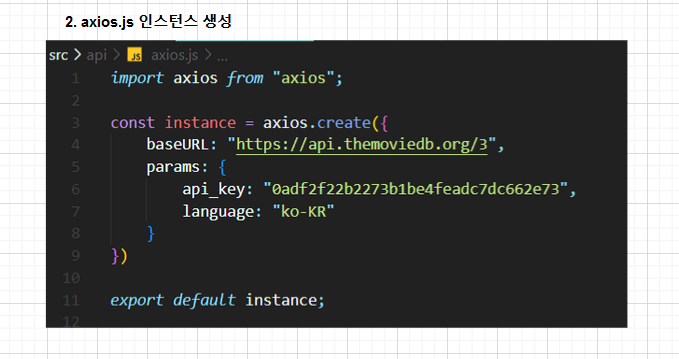
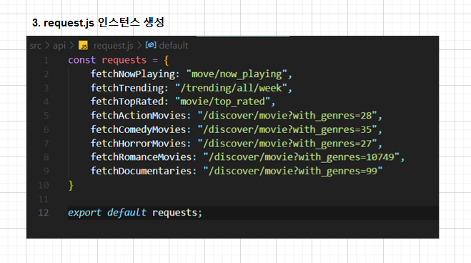

## Axios 인스턴스 생성 및 요청 보내기 

##### The Movie DB API 요청을 위한 Axios 인스턴스 생성 및 요청 보내기 


#### ✔ Axios? 

* Axios : 브라우저, Node.js를 위한 Promise API를 활용하는 HTTP 비동기 통신 라이브러리 
* 벡앤드와 프론트엔드 통신을 쉽게 하기 위해 Ajax와 더불어 사용한다. 


#### ✔ Axios 설치 

```
npm install axios --save
```

> ##### axios.get('https://apo.themoviedb.org/3/trending/all/week')
>
> ##### axios.post('https://apo.themoviedb.org/3/trending/all/week')


#### ✔ Axios 인스턴스화 하는 이유 

##### : 중복된 부분을 계속 입력하지 않아도 되기 때문에 


#### ✔ Axios 인스턴스 만드는 순서 








