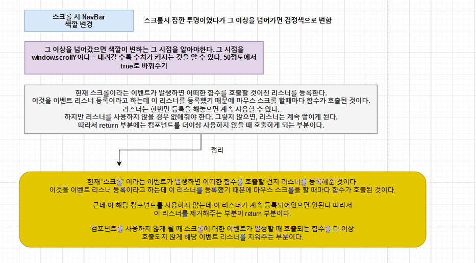

## 2. 네비게이션 컴포넌트 스크롤 구현하기 



```react
import React, { useEffect, useState } from 'react'
import styled from 'styled-components'

const Nav = () => {
  const [show, setShow] = useState(false);

  useEffect(() => {
    window.addEventListener('scroll', () => {
      if(window.screenY > 50) {
        setShow(true);
      }else{
        setShow(false);
      }
    })

    return () => {
      window.removeEventListener('scroll', () => {});
    }
  }, [])
  // 여기는 의존성 배열이다. 여기가  빈 배열 일 경우, 컴포넌트가 한번 만 실행이 된다. 
  // 배열 안에 값이 들어있을때, 그 값이 변할때마다 계속 실행하게 해준다. 

  return (
    <NavWrapper show={show}>
      <Logo>
         (window.location.href = "/")}
        />
      </Logo>
    </NavWrapper>
  )
}

export default Nav
```

```react
const NavWrapper = styled.nav`
  position: fixed;
  top: 0;
  left: 0;
  right: 0;
  height: 70px;
  background-color: ${props => props.show ? "#090b13" : "transparent"};
  display: flex;
  justify-content: space-between;
  align-items: center;
  padding: 0 36px;
  letter-spacing: 16px;
  z-index: 3;
`;
```

```react
const Logo = styled.a `
  padding: 0;
  width: 80p;
  margin-top: 4px;
  max-height: 70px;
  font-size: 0;
  display: inline-block;

  img {
    display: block;
    width: 100%
  }
`;
```

