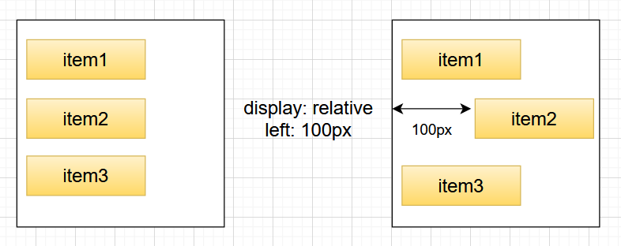
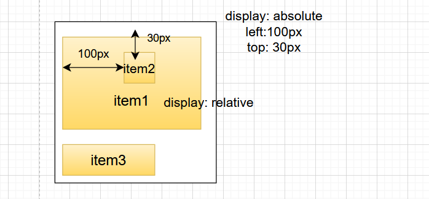
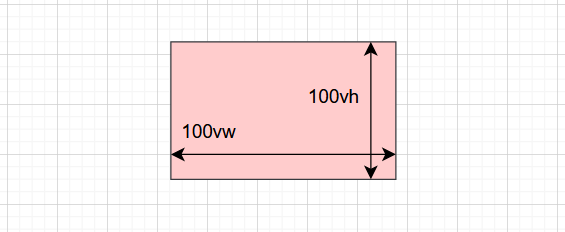

## 3. Styled Componenet를 이용한 비디오 배너 생성하기

#### ✔ Position  CSS

|    static    | 기본값, 다른 태그와의 관계에 의해 자동으로 배치되며 위치를 임의로 설정해 줄 수 있다. |
| :----------: | :----------------------------------------------------------: |
| **relative** | **요소 자기 자신을 기준으로 배치한다 (원래 있던 위치를 기준으로 좌표를 지정한다.)** |
| **absolute** | **부모(조상) 요소를 기준으로 배치한다 (절대 좌표와 함께 위치를 지정해 줄 수 있다.)  부모 요소에 position: static 이 아닌 것이 있으면 그것을 기준으로 배치한다. 하지만 position: static이 아닌 것이 없다면 body를 기준으로 배치한다.** |
|  **fixed**   | **스크롤과 상관없이 항상 문서 최 좌측 상단을 기준으로 좌표를 고정한다(스크롤이 있을 때 스크롤을 내리면 해당 요소도 같이 내려간다. )** |
|  **sticky**  |              **스크롤 영역 기준으로 배치한다.**              |



> 만약 다음과 같이 코드를 작성하게 된다면, 
>
> ```
> display: static
> left: 100px
> top: 100px
> ```
>
> 각각의 item들이 이동하지 않는다 왜냐하면 static은 다른 태그와의 관계에 의해 자동으로 배치가 되기 때문이다. 




> item1이 부모 요소이고 item2는 자식요소이다. 


#### ✔ vh & vw (vertical height & vertical width)

##### 뷰포트의 너비값과 높이값

만약, 뷰포트의 높이값이 800px라면 1vh는 8px이 된다. 

> 뷰포트 : 웹 페이지가 브라우저 화면상에서 실제로 표시되는 영역이다. 




#### ✔ 가상요소 ::before ::after

* 가상 클래스(Pseudo-Class) 는 별도의 class를 지정하지 않아도 지정한 것처럼 요소를 선택할 수 있다. 

* 가상 요소(Pseudo-Element) 는 가상 클래스처럼 선택자(selector)에 추가되며 존재하지 않는 요소를 존재하는 것처럼 부여하여 문서의 특정 부분 선택이 가능하다. 

  ```
  .class::after {}
  ```

  

| ::before    | 요소의 콘텐츠 시작 부분에 생성된 콘텐츠를 추가한다.   |
| ----------- | ----------------------------------------------------- |
| **::after** | **요소의 컨텐츠 끝 부분에 생성된 콘텐츠를 추가한다.** |

##### ⭐ ::before와 ::after는 꼭 'content' 와 같이 쓰여야하며 이 content는 '가짜' 속성이다. 

##### ⭐ HTML 문서에 정보로 포함되지 않은 요소를 CSS에서 새롭게 생성시켜주는 역할을 한다. 

##### ⭐ 여기서는 가상요소 ::after를 이용해서 이미지를 백그라운드에 넣어주기 위해 사용한다. 

```
& after {
	background: url("") center center / cover
		no-repeat  fixed;
	content: "";
	position: absolute;
	inset: 0px;
	opacity: 1;
	z-index: -1;
}
```


---


```react
import styled from 'styled-components';
import './App.css';
import Nav from './components/Nav';

function App() {
  return (
    <Container>
      <Nav />
    </Container>
  );
}

export default App;


const Container = styled.main `
  position: relative;
  min-height: calc(100vh - 250px);
  overflow-x: hidden;
  display: block;
  top: 72px;
  padding: 0 calc(3.5vw + 5px);

  &:after {
    background: url("/images/home-background.png") center center / cover no-repeat fixed;
    content: "";
    position: absolute;
    inset: 0px;
    opacity: 1px;
    z-index: -1px;
  }
`
```

