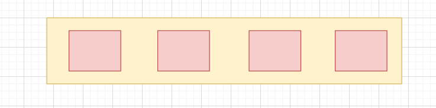
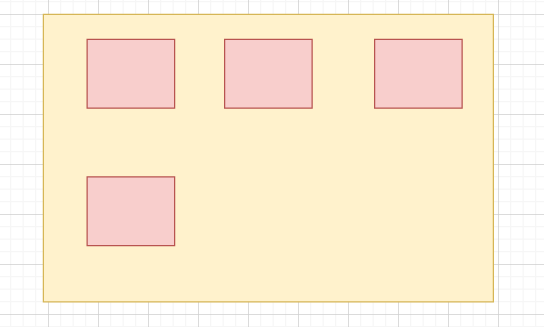
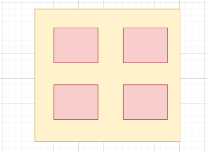

## 5. 이미지 UI 생성하기

##### Banner.js

```react
  return (
    <header
    className='banner'
    style={{
      backgroundImage: `url("https://image.tmdb.org/t/p/original/${movie.backdrop_path}")`,
      backgroundPosition: "top center",
      backgroundSize: "cover"
    }}
    >
      <div className='banner__contents'>
        <h1 className='banner__title'>
          {movie.title || movie.name || movie.original_name}
        </h1>
        <div className='banner__buttons'>
          {movie?.videos?.results[0]?.key &&
            <button
             className='banner__button play'
            >
              Play
            </button>
          }
        </div>

        <p className='banner__description'>
          {movie.overview}
        </p>
      </div>
          <div className='banner--fadeBottom'></div>
    </header>
  )
}

export default Banner
```


#### ✔ 미디어쿼리

> 화면 해상도, 기기 방향 등의 조건으로 HTML에 적용하는 스타일을 전환할 수 있는 CSS3의 속성 중 하나이다. 
>
> 반응형 웹 디자인에서는 미디어 쿼리를 사용해 적용하는 스타일을 기기마다(화면 크기마다) 전환 가능하다. 


```css
#media(조건) {
	스타일
}
```

> 조건이 만족 될 때 스타일 적용하기 



```css
@media (min-width: 1000px) {
    .video-grid {
        grid-template-columns: 1fr 1fr 1fr 1fr;
    }
}
```



```css
@media (min-width: 751px) and (max-width 999px) {
    .video-grid {
        grid-template-coluumns: 1fr 1fr 1fr;
    }
}
```



```css
@media (max-width: 750px) {
    .video-grid {
        grid-template-columns: 1fr 1fr;
    }
}
```


---


##### Banner.css

```css
.banner {
    color: white;
    object-fit: contain;
    height: 448px;
}

@media (min-width: 1500px) {
    .banner {
        position: relative;
        height: 600px;
    }

    .banner--fadeBottom {
        position: absolute;
        bottom: 0;
        width: 100%;
        height: 40rem;
    }
}

@media (max-width: 768px) {
    .banner__contents {
        width: min-content !important;
        padding-left: 2.3rem;
        margin-left: 0px !important;
    }

    .banner__description {
        font-size: 0.8rem !important;
        width: auto !important;
    }

    .info {
        text-align: start;
        padding-right: 1.2rem;
    }

    .space {
        margin-left: 6px;
    }

    .banner_button {
        font-size: 0.8rem !important;
        border-radius: 4px !important;
    }
}

.banner__contents {
    margin-left: 40px;
    padding-top: 140px;
    height: 190px;
}

.banner__title {
    font-size: 3rem;
    font-weight: 800;
    padding-bottom: 0.5rem;
}

.banner__description {
    width: 45rem;
    line-height: 1.3;
    padding-top: 1rem;
    font-weight: 500;
    font-size: 1rem;
    max-width: 400px;
    height: 80px;
}

.banner--fadeBottom {
    height: 7.4rem;
    background-image: linear-gradient(180deg,
            transparent,
            rgba(37, 37, 37, 0.61),
            #111);
}

.banner__buttons {
    display: flex;
    flex-direction: row;
}

.banner__button {
    display: flex;
    justify-content: start;
    align-items: center;
    cursor: pointer;
    outline: none;
    border: none;
    font-size: 1rem;
    font-weight: 700;
    padding: 0.4rem 1rem;
    margin-right: 1rem;
}

.banner__button:hover {
    color: #000;
    background-color: rgba(170, 170, 170, 0.9);
    transition: all 0.2s;
}

.play {
    background-color: white;
    color: black;
}


.element {
    inset: 1em 2em 3em 0;
    /* top right bottom left */
    inset: 10% 5% -10%;
    /* top left/right bottom */
    inset: 0 10px;
    /* top/bottom left/right */
    inset: 20px;
    /* all edges = 20px */
}
```

