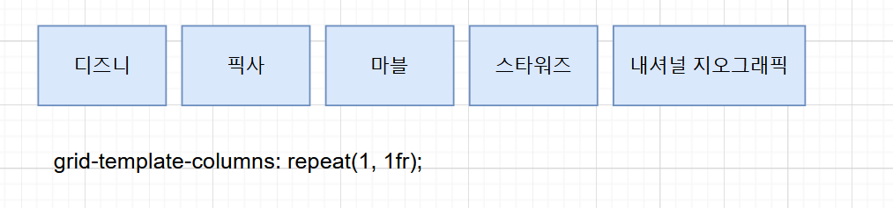

## 01. Category 컴포넌트 생성하기 

#### ◼ UI 생성하기 

```javascript
const Category = () => {
  return (
    <Container>
      <Wrap>
        
        {/* 최근에는 많은 브라우저에서 소리가 꺼진 상태에서 동영상만 자동 재생할 수 있으므로 동영상 태그에도 muted 속성을 추가해야한다. */}
        {/* muted : 소리가 나오지 않도록 설정 */}
        <video autoPlay loop muted>
            <source src="/videos.disney.mp4" type="video/mp4" />
        </video>
      </Wrap>
    </Container>
  )
}
```




---


#### ✔ transition

```css
transition: opacity 500ms ease-in-out 0s;
```

> **transition : < prooperty > < duration >**
>
> * 스타일 변경 시 부드럽게 전호나하게 합니다. (흔히 호버링할 때 사용됨)
> * 선택자가 변화되는 것을 시간의 흐름을 줘서 변화시키는 속성 
> * transition : 0.20s 도 가능 
> * transition : 속성 시간 속도 지연 시간 ; 
> * 호버할 때 백그라운드 색을 3초 사이에 서서히 검정색으로 전환합니다. 


```css
transition: box-shadow 2s ease-in;
```

> **변화 되는 시간에 ease(가속 감속)처리** 
>
> * ease : 기본 값, 느기게 시작한 다음 빠른 게 전환한 다음 천천히 종료 
>
> * linear : 처음부터 끝까지 같은 속도로 전환 
>
> * ease-in : 가속, 느린 시작으로 빠른 끝 -- 느긴 느낌을 받을 수 있다. 
>
> * ease-out :  감속, 빠른 시작으로 느린 끝 -- 빠른 느낌을 받을 수 있다. 
>
> * ease-in-out : 느린 시작과 느린 끝으로 전환 효과 지정 
>
> * cubic-bezier(n, n, n, n) : 3차 베지어 함수에서 자신의 값을 임의적으로 정함 
>
>   * cubic-bezier() 는 이 베지어 곡선을 정의 하는 거라고 이해하면 된다. 
>
>   * 베지어 곡선 : 부드러운 곡선을 모델링 하기 위해 컴퓨터 그래픽에서 널리 사용된다. 
>
>     커브가 컨트롤 포인트의 볼록한 선체에 완전히 포함되어 있기 때문에 점을 그래픽으로 표시하고 
>
>     직관적으로 커브를 조작하는 데 사용할 수 있다. 
>
>     변환 및 회전과 같은 어피니션 변환은 곡선의 제어점에 각각의 변환을 적용하여 곡선에 적용할 수 있다.
>
> ```css
> transition: all 250ms cubic-bezier(0.25, 0.46, 0.45, 0.94) 0s;
> ```
>
> > 0s 끝에 있는 건, 딜레이 시간 


#### ✔ transform 

##### transform : none | transform-functions | initial | inherit;

* transition : 선택자가 변화되는 것을 시간의 흐름을 줘서 변화시키는 속성 

* animation : 하나의 줄거리(@keyframes) 를 구성하여 줄거리 내에서 세부 움직임을 시간 흐름 단위로 제어하여 요소의 움직임을 표현한다. 

* transform 

  > * CSS transform 속성으로 요소에 회전(rotate), 크기 조절(scale), 기울이기(skew), 이동(translate)효과를 부여할 수 있습니다. transform 은 CSS 시각적 서식 모델의 좌표 공간을 변경합니다. 
  > * 애니메이션 효과를 제공하지는 않습니다. 그래서 정의된 프로퍼티가 바로 적용되어 화면에 표시됩니다. 
  > * 트랜스폼은 애니메이션 효과를 위해 사용하여야 하는 것은 아니지만 애니메이션 효과를 부여할 필요가 있다면 트랜지션이나 애니메이션과 함께 사용해야 합니다. 