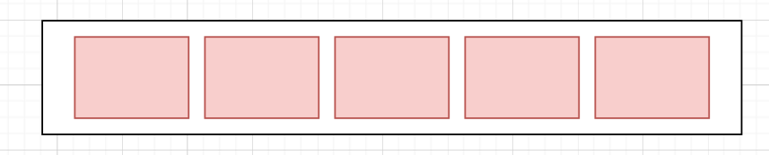
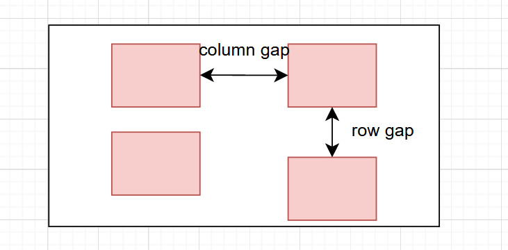
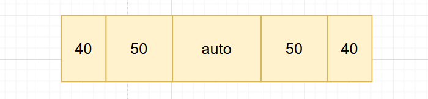
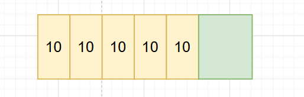
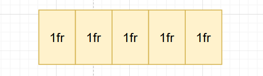
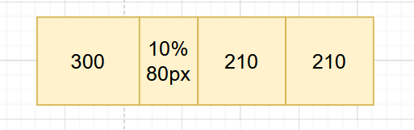
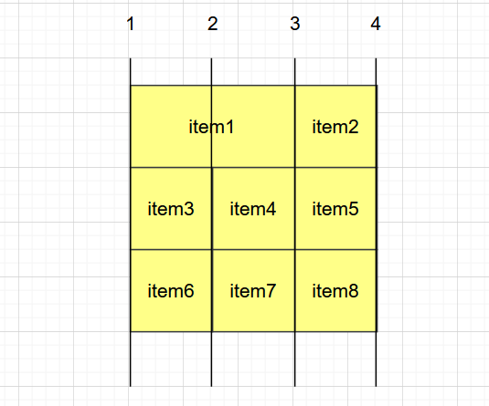

## 02. Grid CSS

#### ◼ GRID 

> Flexible Box 는 단순한 1차원 레이아웃을 제공한다. **(행 row 또는 열 column 하나씩!)**
>
> 이에 비해 CSS Grid 는 2차원 행과열 의 레이아웃 시스템을 제공한다. **(행 row 또는 열 column 같이!)**

##### CSS GRID 는 CSS 모둘이다. 




#### ◼ Grid CSS 속성들 

##### 1. gap : 공백으로 구분된 값 목록으로 그리드의 열과 행을 정의한다. 값은 트랙 크기를 나타내고 그 사이의 공간은 grid line 격자선을 나타낸다. 

```css
gap : 25px;
grid-template-columns: repeat(5, 1fr);
```



```css
.container {
    grid-template-columns: 40px 50px auto 50px 40px;
}
```



```css
.container {
    grid-template-clumns: repeat(5, 10px;)
}
```



##### 1r = fraction 1fr은 사용 가능한 공간의 1 부분이다. (사용 가능한 공간에 대한 비율)

```css
.container {
    grid-template-colums: repeat(5, 1fr);
}
```



```css
.container {
    width: 800px
    grid-template-colums: 300px 10% 1fr 1fr;
}
```



> **380px, 420px, 전체 800px**


```react
<div class="grid-container">
    <div class="item1">1</div>
    <div class="item2">2</div>
    <div class="item3">3</div>
    <div class="item4">4</div>
    <div class="item5">5</div>
    <div class="item6">6</div>
    <div class="item7">7</div>
    <div class="item8">8</div>
</div>
```

```css
.grid-container {
    display: grid;
    grid-template-colums: auto auto auto;
    gap: 10px;
    background-color: #2196f3;
    padding: 10px;
}

.item1 {
    grid-colums-start: 1;
    grid-colums-end: 3;
}
```

